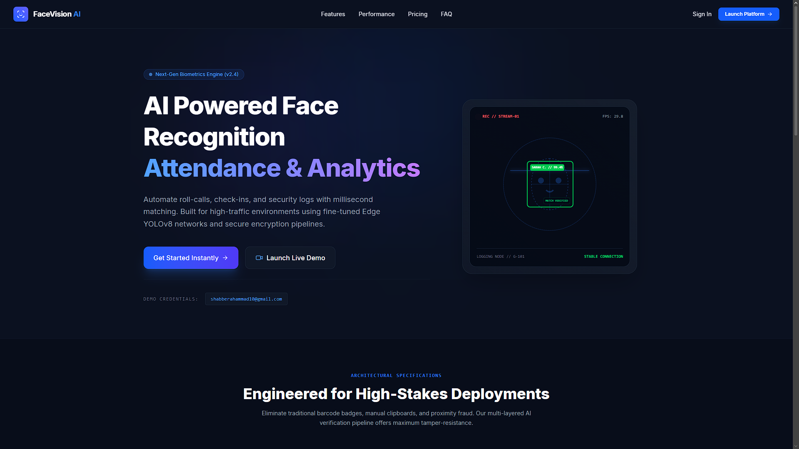
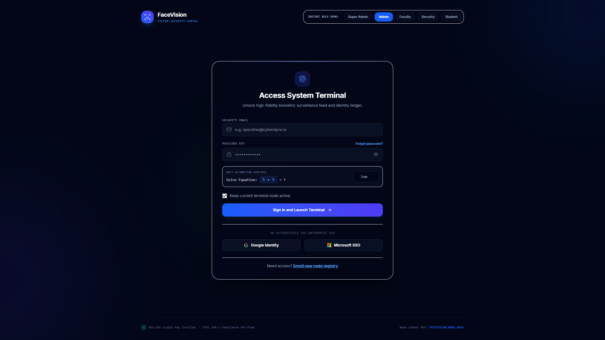
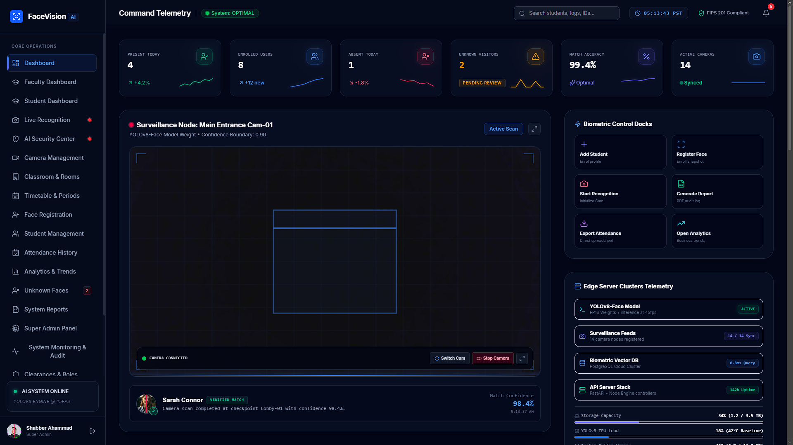
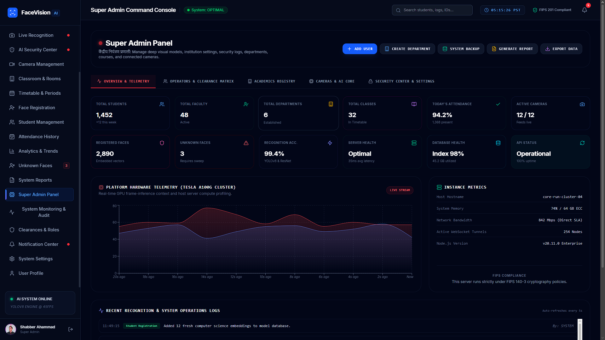
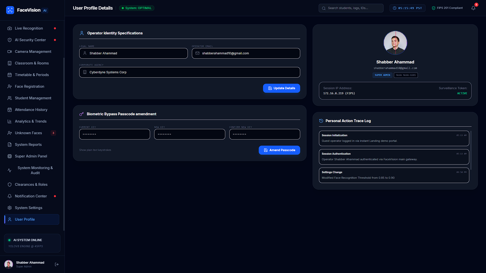
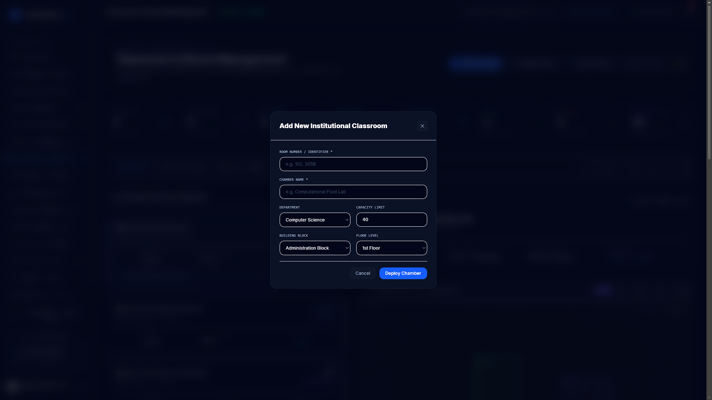
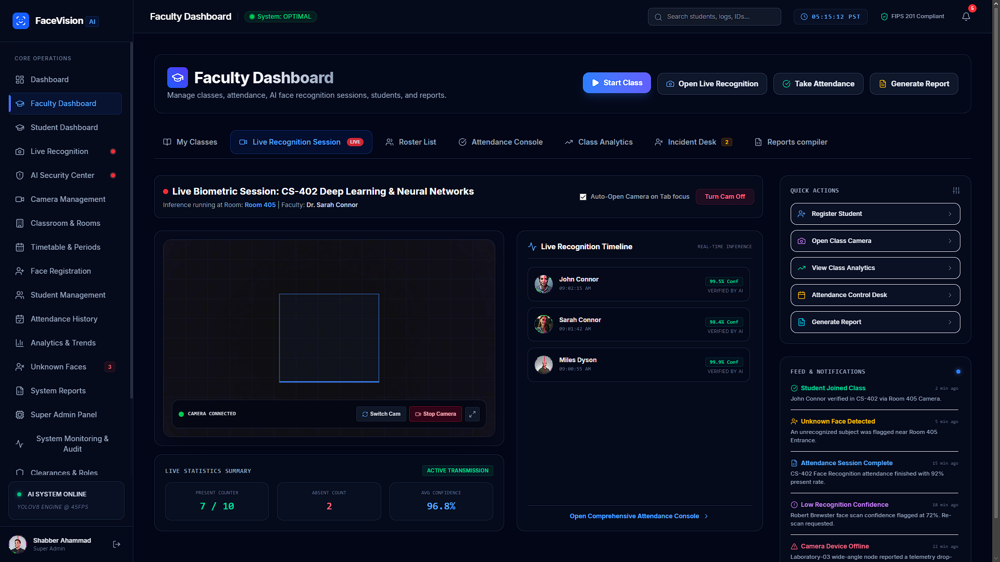
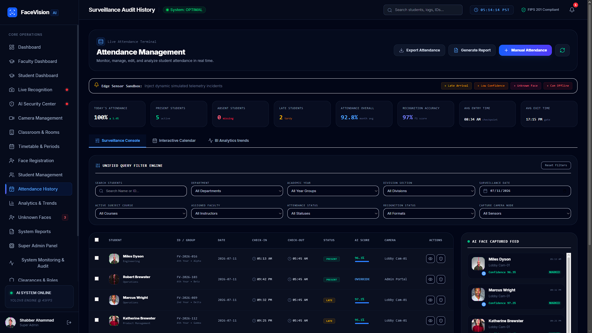
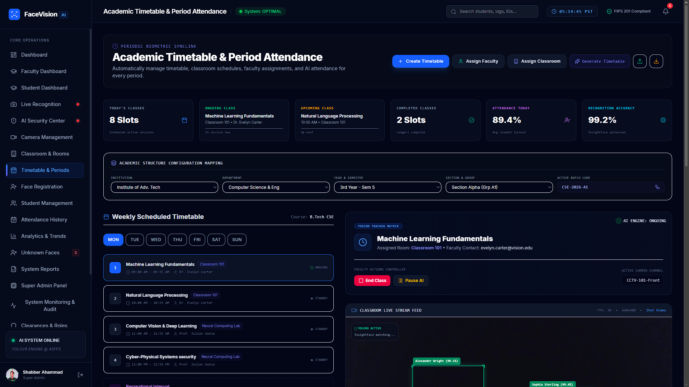

# FaceVision AI

AI-Powered Face Recognition Attendance System

## Features

- Face Recognition using InsightFace
- Attendance Management
- Student Registration
- User Role Management
- Dashboard & Analytics
- FastAPI Backend
- React + TypeScript Frontend
- PostgreSQL Database

## Tech Stack

- React
- TypeScript
- FastAPI
- Python
- PostgreSQL
- SQLAlchemy
- InsightFace
- OpenCV

## Installation

### Frontend

```bash
npm install
npm run dev
```

### Backend

```bash
pip install -r requirements.txt
uvicorn app.main:app --reload
```

## Project Structure

- Frontend (React + TypeScript)
- Backend (FastAPI)
- PostgreSQL Database

## Author

Shabber Ahamad


# 📸 Screenshots

## 🖥️ Face Recognition Interface


## 🔐 Admin Login


## 📊 Dashboard


## 🛠️ Admin Panel


## 👨‍🎓 Student Registration


## 👤 User Details


## 🏫 Classrooms & Departments


## 📅 Class Attendance


## 📈 Attendance History


## 🗓️ Time Table

