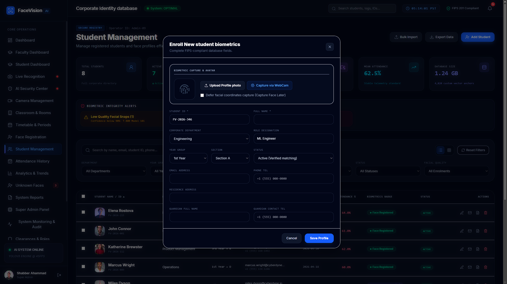

<div align="center">

# FaceVision AI

### AI-Powered Face Recognition Attendance System

An AI-powered face recognition attendance management system built with React, TypeScript, FastAPI, PostgreSQL, InsightFace, and OpenCV.

[](https://face-vision-3mdmztbg8-shabber-62s-projects.vercel.app)
[](https://github.com/shabber-62/FaceVision-Ai)
[](https://react.dev/)
[](https://fastapi.tiangolo.com/)
[](https://www.postgresql.org/)

</div>

---

## 📖 Overview

FaceVision AI is an AI-powered attendance management system that automates attendance using facial recognition. It provides a modern web dashboard for managing students, classrooms, attendance history, analytics, and user roles.

---

## ✨ Features

- 🎯 AI Face Recognition using InsightFace
- 👨‍🎓 Student Registration
- 👤 User Management
- 🏫 Classroom & Department Management
- 📅 Attendance Tracking
- 📖 Attendance History
- 📊 Dashboard & Analytics
- 🗓️ Timetable Management
- 🔐 Secure Authentication
- ⚡ FastAPI REST API
- 💾 PostgreSQL Database

---

## 🛠️ Tech Stack

| Category | Technologies |
|----------|--------------|
| Frontend | React, TypeScript, Vite |
| Backend | FastAPI, Python |
| Database | PostgreSQL |
| AI | InsightFace, OpenCV |
| ORM | SQLAlchemy |

---

## 🚀 Live Demo

**Frontend**

https://face-vision-3mdmztbg8-shabber-62s-projects.vercel.app

---

## 📂 Project Structure

```
FaceVision-AI
│
├── src/
├── backend/
├── assets/
├── screenshots/
├── package.json
├── vite.config.ts
└── README.md
```

---

## ⚙️ Installation

### Frontend

```bash
npm install
npm run dev
```

### Backend

```bash
cd backend

pip install -r requirements.txt

uvicorn app.main:app --reload
```

---

## 📸 Screenshots

### 🖥️ Face Recognition Interface


### 🔐 Admin Login


### 📊 Dashboard


### 👨‍💼 Admin Panel


### 👨‍🎓 Student Registration



### 👤 User Details


### 🏫 Classrooms & Departments


### 📅 Class Attendance


### 📖 Attendance History


### 🗓️ Timetable


---

## 🎯 Future Improvements

- Email Notifications
- Mobile Application
- Multi-Camera Support
- Face Anti-Spoofing
- Cloud Deployment
- Docker Support
- Real-time Notifications
- QR Code Attendance Backup

---

## 👨‍💻 Author

**Shabber Ahamad**

B.Tech Computer Science & Engineering

GitHub:
https://github.com/shabber-62

---

## ⭐ Support

If you like this project, please ⭐ the repository.
